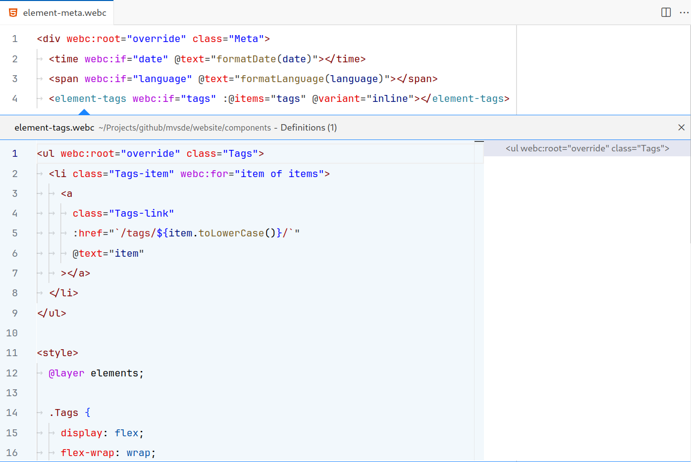

# WebC for VS Code

Please refer to the [WebC documentation](https://www.11ty.dev/docs/languages/webc/) for how to use WebC in general or in your [Eleventy](https://www.11ty.dev/) project in particular.

## Features

- [Autocomplete](#autocomplete)
- [Documentation](#documentation)
- [Definitions](#definitions)

## Autocomplete

Provides `webc:` and `@` attribute autocomplete suggestions for HTML tags.

## Documentation

`webc:` and `@` attributes show a link to the WebC documentation on hover.

## Definitions

Support for _Go to Definition_ and _Peek Definition_ ([VS Code _Peek_ documentation](https://code.visualstudio.com/docs/editor/editingevolved#_peek)) and <kbd>Ctrl</kbd> + Click on WebC component tags to go the source file.

